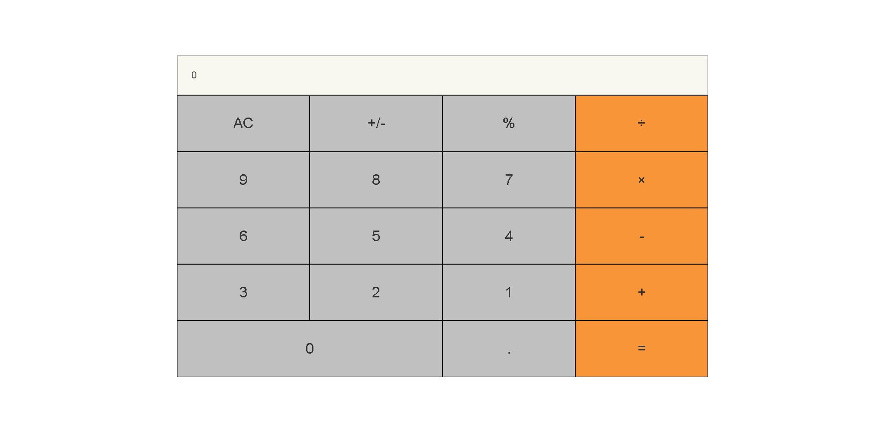

# math-magicians

this is a Calculator using react js

## Screenshot

### Desktop screenshot



## Author

**Yahya EL Ganayni**

- GitHub: [@yahyaELganayni](https://github.com/yahyaelganyni1)
- Twitter: [@yahyaELganayni](https://twitter.com/@crazy20046)
- LinkedIn: [yahyaELganayni](https://www.linkedin.com/in/yahya-el-ganayni-a456115b/)

### 1. Setup

- Set up Git flow
- Set up React
- Set up linters
- Configure deploy

### 2. Create components

- Create components based on identified hierarchy

```
Calculator
- Display
- Keyboard
  - Key(s)
```

- Use Grid to for structure styling
- Implement conditional attributes

### 3. Implement event handlers

- Use provided logic files for calculator functions
- Implement event handler for Key
- Lift state up to Calculator
- Pass state as props to Display

### 4. Refactor with hooks

- Convert class components to functional components
- Implement state and memo hooks

### 5. Add multi-pages and implement routing

- Implement routing with React Router
- Create components for based on identified hierarchy for full website:

```
- Header
  - WebsiteTitle
  - NavigationBar
- Route: Home
  - PageHeading
  - TextBody
- Route: Calculator
  - Display
  - Keyboard
    - Key(s)
- Route: Quote
  - TextBody
```

- Add styling with React basic styling

## Built With

- Major languages: JS, SCSS
- Others: JSX
- Libraries used: React

# Clone repos on GitHub

[![GoDoc Badge][]][godoc]
[![Mac and Linux Build Status][]][travis ci]
[![Windows Build Status][]][appveyor]
[![Coverage Status][]][codecov]

```
$ github-clone-all [flags] {query}
```

`github-clone-all` is a small command to clone all repositories matching to the given query and
language via [GitHub Search API][]. To know the detail of query, please read
[official document for GitHub Repository Search][github repository search]. The query should be in
[GitHub search syntax][] and cannot be empty. It clones many repositories in parallel. Please see
`-help` option to know all flags.

Repositories re cloned to 'dest' directory. It is `./repos` by default and can be specified with
`-dest` flag. And in order to reduce size of cloned repositories, `-extract` option is available.
`-extract` only leaves files matching to the given regular expression in cloned repository.

Because of restriction of GitHub search API, the max number of results is 1000 repositories. And you
may need to get GitHub API token in advance to avoid hitting API rate limit. `github-clone-all` will
refer the token via `-token` flag or `$GITHUB_TOKEN` environment variable.

All arguments in `{query}` are regarded as query. For example, `github-clone-all foo bar` will search
`foo bar`. But quoting the query is recommended to avoid conflicting with shell special characters
as `github-clone-all 'foo bar'`.

## Installation

Use `go get` or [released binaries](https://github.com/rhysd/github-clone-all/releases).

```
$ go get github.com/rhysd/github-clone-all
```

## Example

```
$ github-clone-all -extract '(\.vim|vimrc)$' 'language:vim fork:false stars:>1'
```

The above command will clone first 1000 repositories into `./repos` directory directory. And it only
leaves files whose file name ends with `.vim` or `vimrc`.
So it collects many Vim script files from famous repositories on GitHub.

Query condition:

- language is 'vim'
- not a fork repo
- stars of repo is more than 1

```
$ github-clone-all -count 1 'language:javascript'
```

The above command will clone the most popular repository of JavaScript on GitHub.

```
$ github-clone-all -dry 'language:go'
```

The above command will only list up most popular 1000 repositories of Go instead of cloning them.

```
$ github-clone-all -deep -ssh 'user:YOUR_USER_NAME fork:false'
```

The above command will clone all your repositories (except for forks) with full history.
It's useful when you want to clone all your repositories.

## How to get GitHub API token

1. Visit https://github.com/settings/tokens in a browser
2. Click 'Generate new token'
3. Add token description
4. Without checking any checkbox, click 'Generate token'
5. Generated token is shown at the top of your tokens list

## Use github-clone-all programmatically

`github-clone-all` consists of tiny `main.go` and `ghca` package. You can import `ghca` to utilize
functions of the tool.

```go
import "github.com/rhysd/github-clone-all/ghca"
```

## 🤝 Contributing

Contributions, issues, and feature requests are welcome!

Feel free to check the [issues page](../../issues/).

## Show your support

Give a ⭐️ if you like this project!
